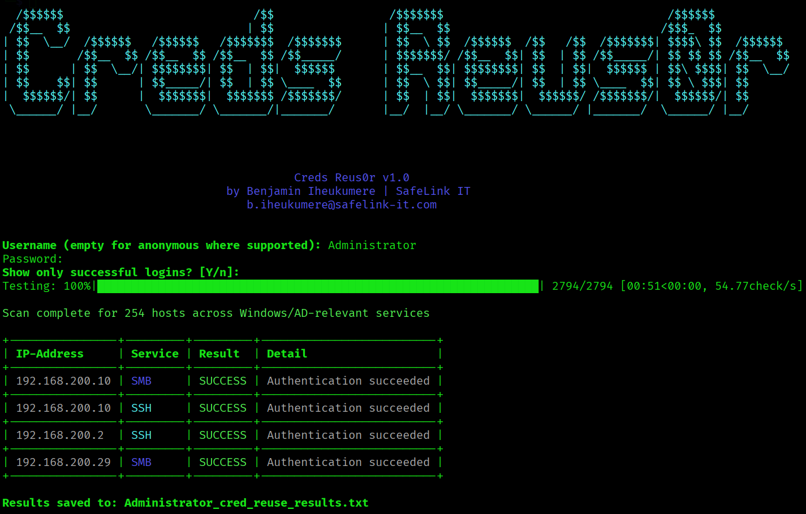

# Credential Reuse0r

**Credential Reuse Check0r** is a fast, multithreaded offensive security tool for testing credential reuse across multiple network services, especially in Windows Active Directory environments.

It allows you to test the same set of credentials against a range of hosts and protocols, such as SMB, LDAP/LDAPS, WinRM, SSH, FTP, MSSQL, and more.  
The tool supports both anonymous and authenticated checks, provides a colored table output, and saves results to a file.

---

## Features

- **Multi-service credential testing**:
  - SMB (445/TCP)
  - SSH (22/TCP)
  - FTP (21/TCP)
  - LDAP / LDAPS (389 / 636 TCP)
  - LDAP Global Catalog (3268 / 3269 TCP)
  - WinRM HTTP / HTTPS (5985 / 5986 TCP)
  - RDP (3389 TCP, port check only)
  - MSSQL (1433 TCP)
- **Anonymous and authenticated testing**
- **Parallel scanning** (configurable number of threads)
- **Colored table output** for quick visual results
- **Progress bar** to track scan progress
- **Filter results**: choose to display only successful logins or all attempts
- **Results saved** to a file with the username as prefix (e.g. `t.user_cred_reuse_results.txt` or `anon_cred_reuse_results.txt`)
- **Dependency auto-check**: If a required library for a protocol is missing, the tool notes it in the results.

---

## Installation

1. Install dependencies
  ```bash
pip install tqdm impacket paramiko ldap3 pywinrm pymssql
```
2. Clone this repository:
  ```bash
git clone https://github.com/BenjaminIheukumere/creds_reus0r
cd creds_reus0r.py
chmod +x creds_reus0r
```
## Usage
  ```bash
./creds_reus0r <IP-RANGE>
```

Enter Username & Password for authenticated scan.
Leave Username empty (just press enter) for anonymous scan.

## Examples
Single IP:
  ```bash
./creds_reus0r 10.10.10.10
```
IP-Range:
```bash
./creds_reus0r 10.10.10.0/24
```

## Notes
- Anonymous mode: Works for services that allow null or guest sessions.
- RDP check: Only checks if TCP/3389 is open — does not perform authentication.
- WinRM: Requires pywinrm and requests-ntlm for authentication.
- MSSQL: Requires pymssql.

## Output
- Authenticated Scan: Found credentials will be put in #USERNAME#_cred_reuse_results.txt
- Unauthenticated Scan: Found shares will be put in anon_cred_reuse_results.txt

Content of the output file will be printed on screen, when scan is done, too, if shares were found.

## Screenshot of Creds Reus0r in action


## Disclaimer
This tool is intended for authorized security testing only.
Use it only in environments where you have explicit permission.
The author is not responsible for any misuse or damage caused by this tool.

